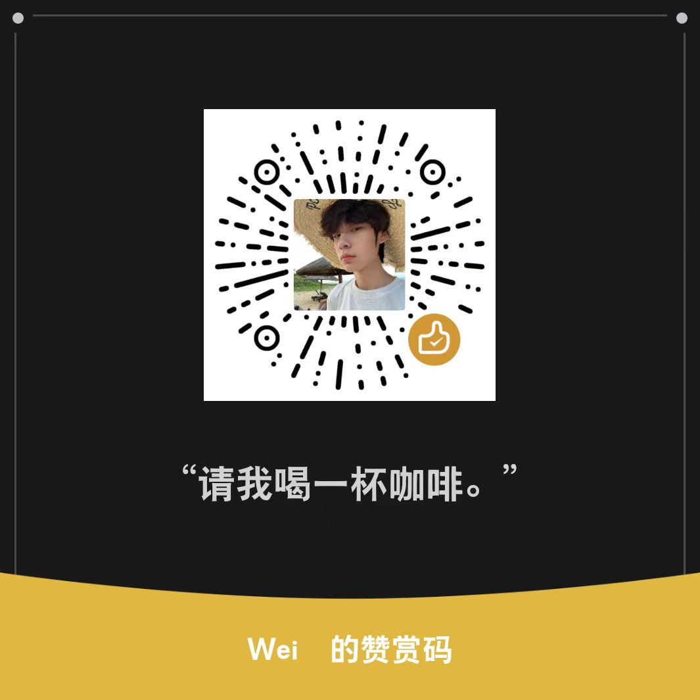

# AutoJS6 自动续火花

使用教程（文字版）

文档编写时间：2026年9月5日

## 前言

本文档将介绍如何使用 AutoJS6 自动续火花，帮助你轻松实现每日自动续火花。本脚本支持**抖音**和**快手**两个平台的自动续火花功能。

## 准备工作

- 一台 Android 手机（Android 7.0 及以上）
- 抖音 / 快手 App 已安装并登录

## 步骤一：安装 AutoJS6

下载并安装 AutoJS6：[点此跳转 releases 下载](https://github.com/SuperMonster003/AutoJs6/releases)

如果无法访问，可以使用镜像站下载：[点此跳转下载 AutoJS6(v6.7.0)](https://ghproxy.net/https://github.com/SuperMonster003/AutoJs6/releases/download/v6.7.0/autojs6-v6.7.0-arm64-v8a-62db1ff8.apk)

下载并安装 Shizuku：[点此跳转 releases 下载](https://github.com/RikkaApps/Shizuku/releases)

如果无法访问，可以使用镜像站下载：[点此跳转下载 Shizuku(v13.6.0)](https://ghproxy.net/https://github.com/RikkaApps/Shizuku/releases/download/v13.6.0/shizuku-v13.6.0.r1086.2650830c-release.apk)

## 步骤二：配置 AutoJS6

1. 打开并启用 Shizuku，启用教程可以参考这位大佬的视频：[安卓免root神器，Shizuku全机型激活教程！](https://www.bilibili.com/video/BV1Ac1dYSELU)

2. 安装完成后，根据下图赋予相关权限：

设置 AutoJS6 应用的权限（手机设置中修改）：
- 无障碍权限
- 应用自启动
- 后台无限制
- 获取应用列表
- 媒体音量控制
- 后台弹出界面
- 显示悬浮窗
- 允许通知
- 修改系统设置

3. 打开 AutoJS6，点击左上角的菜单按钮，选择"新建"，粘贴复制好的脚本文件（`快手.js` 或抖音脚本）。

## 步骤三：配置脚本

1. **设置续火花对象**：根据脚本注释修改要续火花的人的名字，名字用英文逗号隔开，并填写在英文引号内。

2. **设置锁屏密码**：根据脚本注释修改自动输入的密码，目前密码仅支持数字密码，填写你的锁屏密码。如不需要密码解锁可删除对应代码。

## 步骤四：运行脚本

- 点击运行按钮，脚本开始运行，等待脚本运行完成
- 推荐使用定时任务，定时运行脚本
- 脚本运行过程中请勿操作手机，等待脚本运行完成
- 运行完成后，应用会自动关闭后台
- 脚本运行完成后，手机会自动锁屏

## 脚本运行情况

| 情况 | 说明 |
|------|------|
| 运行中 | 请勿操作手机 |
| 运行完成 | 应用自动关闭后台 |
| 运行完成 | 手机自动锁屏 |

## 重要提示

> **在下载、安装或使用本脚本之前，请您务必仔细阅读并充分理解用户使用协议的所有条款。您的下载、安装或使用行为即被视为您已完全阅读、理解并同意接受本协议的全部条款约束。如果您不同意本协议的任何内容，请立即停止使用并删除本脚本。**

> **脚本仅供个人学习交流使用，请勿用于商业用途，否则后果自负。如您因使用脚本造成任何损失，本人概不负责。**

## 相关链接

- 视频教程：[B站视频](https://www.bilibili.com/video/BV11beMzNEgS)
- 参考文档：[automatic-spark-renewal](https://gitee.com/coldestbow30654/automatic-spark-renewal/tree/main)

## 支持

如果觉得这个项目不错，欢迎请我喝杯咖啡 ☕

---

> 本项目脚本文件：`快手.js`